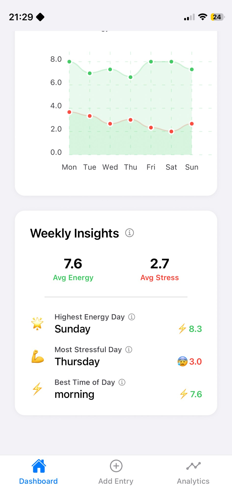
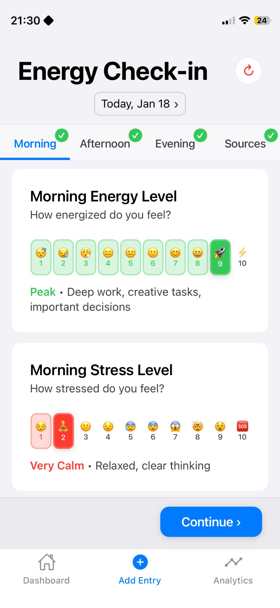
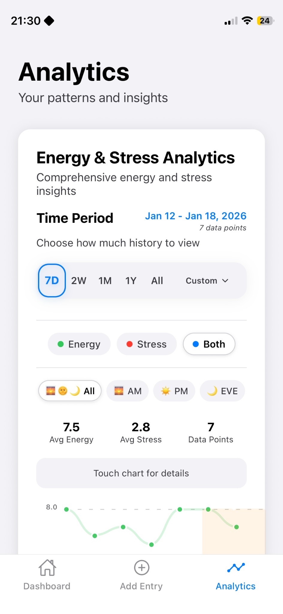
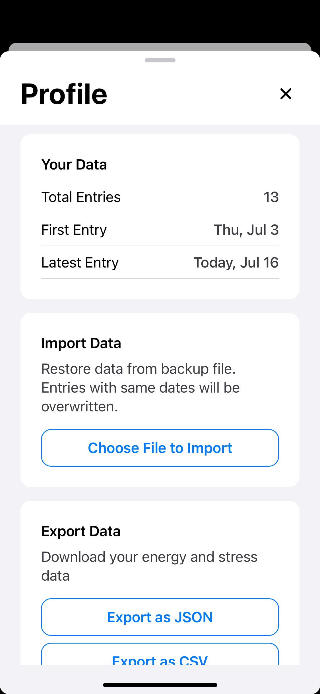
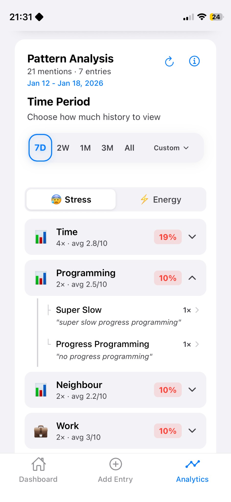
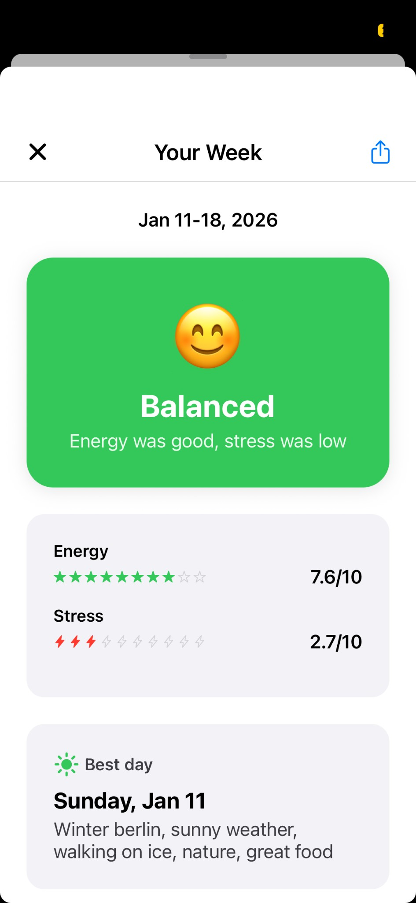
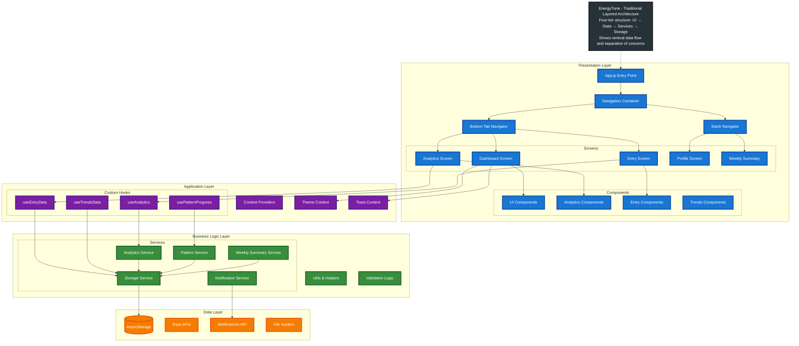
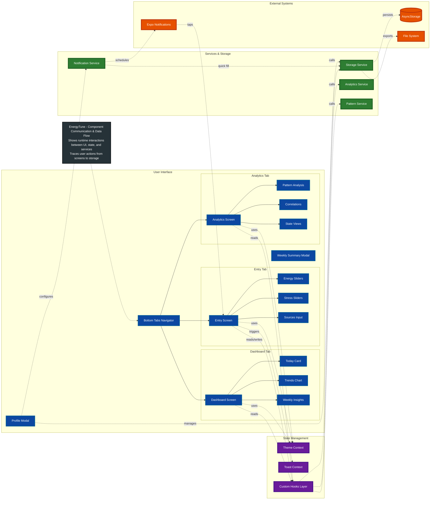
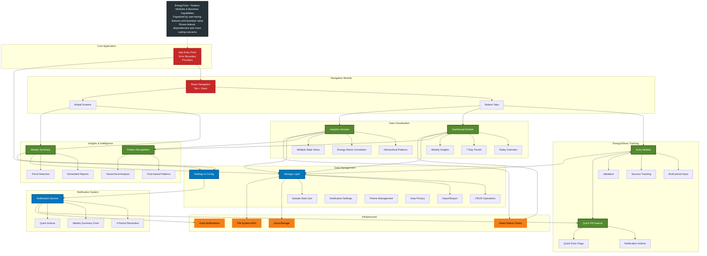

# EnergyTune

**Professional Energy & Stress Tracking App**

A React Native + Expo app that helps you understand your energy patterns. Born from my own need to track stress and energy data during coaching, it's been validated through over a year of personal use. Designed for quick daily logging (3 taps) with complete local privacy.

> **Why EnergyTune?** Unlike basic mood trackers, EnergyTune reveals long-term energy patterns across work and personal life, helping busy professionals identify peak productivity windows and eliminate stress triggers before they become chronic burnout cycles.


## 📱 App Preview

<div align="center">
  
### Energy Dashboard


<sub><em>Track your energy patterns with minimalist-style elegance</em></sub>

---

### Complete Experience

<table align="center">
  <tr>
    <td align="center" width="200">
      
      <br><sub><b>Weekly Trends</b><br>7-day energy patterns</sub>
    </td>
    <td align="center" width="200">
      
      <br><sub><b>3-Tap Entry</b><br>Log in seconds, seamless flow</sub>
    </td>
    <td align="center" width="200">
      
      <br><sub><b>Trends</b><br>Your data, explained</sub>
    </td>
  </tr>
  <tr>
    <td align="center">
      
      <br><sub><b>Profile</b><br>Import & export, it's your data</sub>
    </td>
    <td align="center">
      
      <br><sub><b>Smart Insights</b><br>Correlation analysis between energy and stress</sub>
    </td>
    <td align="center">
      
      <br><sub><b>Weekly Insights</b><br>Comprehensive weekly energy & stress analysis</sub>
    </td>
  </tr>
</table>

</div>

<div align="center">
  <sub><em>Clean, intuitive design that feels native on every platform</em></sub>
</div>

## Key Features

- **🚀 Zero Learning Curve**: Intuitive native-style interface
- **⚡ Sub-200ms Response**: Optimized performance with haptic feedback
- **📱 Native Mobile**: Built for iOS and Android with React Native
- **🔄 Offline-First**: Local storage with AsyncStorage
- **📊 Smart Analytics**: Pattern recognition and actionable insights
- **🎨 Native Design**: Human Interface Guidelines compliance
- **🔒 Privacy-First**: 100% local AI - your data never leaves your device

## 🌱 Why I Built This

During a coaching session, I was asked about my stress factors - and realized I had no real data, just vague feelings. So I started tracking them. But focusing only on stress felt draining, so I added energy gains for balance. What started as a simple web app for my own use has been running for over a year now, and the patterns it revealed are super helpful to me.

EnergyTune helps when you notice patterns like crashing every Tuesday afternoon or feeling drained after certain types of meetings, but also when you want to understand what actually energizes you.

**Especially useful if you:**

- Track other health metrics but miss the energy/stress connection
- Want to understand your patterns without sending data to yet another company
- Need something that works offline (no internet dependency)
- Appreciate being able to verify privacy claims through open code
- Prefer tools that respect your time (3 taps, done)

## 🚀 Quick Start

### Prerequisites

- **Node.js 18+** (LTS recommended)
- **npm** or **yarn**
- **iOS Development**: macOS with Xcode installed
- **Android Development**: Android Studio with Android SDK

### Installation

```bash
# Clone the repository
git clone https://github.com/quarocx/energytune.git
cd energytune

# Install dependencies
npm install
```

### Running the App

EnergyTune uses native modules (notifications, file system, haptics) and requires a **development build** or **physical device build**. Expo Go is not sufficient.

#### Option 1: iOS Development Build (Recommended)

```bash
# Run on iOS simulator or connected device
npx expo run:ios
```

This will:
- Build the native iOS app with all dependencies
- Launch iOS Simulator or install on connected device
- Start Metro bundler automatically

#### Option 2: Android Development Build

```bash
# Run on Android emulator or connected device
npx expo run:android
```

This will:
- Build the native Android app with all dependencies  
- Launch Android Emulator or install on connected device
- Start Metro bundler automatically

#### Option 3: Development Server Only

```bash
# Start Metro bundler
npx expo start

# Then in another terminal, run platform-specific build:
npm run ios     # For iOS
npm run android # For Android
```

**Note:** The app cannot run in Expo Go due to native module dependencies. You must build the native app using the commands above.

### Additional Commands

```bash
# Clear Metro cache (helpful for troubleshooting)
npx expo start --clear

# Clean build (if you encounter issues)
npx expo prebuild --clean
```

## ✅ Implementation Status

### Completed ✅

- [x] **Core Infrastructure**: Expo JavaScript setup with clean architecture
- [x] **Design System**: Native-style colors, typography, spacing (8px grid)
- [x] **Data Models**: Well-structured data interfaces for DailyEntry, analytics, insights
- [x] **Navigation**: Tab-based navigation (Dashboard/Entry/Analytics)
- [x] **UI Components**: Button, Card, Input with haptic feedback
- [x] **Rating System**: Energy/Stress rating with button-based selection
- [x] **Charts**: React Native Chart Kit trend visualization
- [x] **Analytics**: Local AI pattern recognition & insights generation
- [x] **Local Storage**: AsyncStorage for offline-first data persistence
- [x] **Native Features**: Notifications, haptics, file system integration
- [x] **Smart Insights**: Local and lightweight AI pattern recognition
- [x] **iOS & Android**: Full native builds with Expo SDK 54

### Next Steps 🔄

- [ ] **Advanced AI pattern recognition**: Offline data-privacy friendly pattern analysis

## 🛠️ Tech Stack

| Category       | Technology             | Purpose                           |
| -------------- | ---------------------- | --------------------------------- |
| **Framework**  | React Native + Expo    | Cross-platform development        |
| **Language**   | JavaScript (ES6+)      | Modern JavaScript development     |
| **Charts**     | React Native Chart Kit | Data visualization                |
| **Navigation** | React Navigation       | Screen routing                    |
| **Storage**    | AsyncStorage           | Local data persistence            |
| **AI/ML**      | Custom lightweight AI  | Privacy-first pattern recognition |
| **Styling**    | StyleSheet             | Native-style design system        |

## 🏗️ Architecture

EnergyTune follows a clean, modular architecture with clear separation of concerns. Below are three complementary views of the system architecture, each highlighting different aspects:

### 1. Layered Architecture View

**What it shows:** Four-tier structure (Presentation → Application → Business Logic → Data) with vertical data flow and clear separation of concerns. Best for understanding code organization and onboarding new developers.



**Color Legend:** 🔵 Presentation Layer | 🟣 Application Layer | 🟢 Business Logic | 🟠 Data Layer

---

### 2. Component Interaction & Data Flow View

**What it shows:** Runtime interactions between UI components, state management, and services. Shows how data flows through the app and how features communicate. Perfect for debugging and understanding feature implementation.



**Connection Types:** Solid lines (→) = Navigation/containment | Dotted lines (-.->)= Data flow/calls

**Color Legend:** 🔵 User Interface | 🟣 State Management | 🟢 Services | 🟠 External Systems

---

### 3. Feature-Centric Module View

**What it shows:** The app organized by user-facing features and business capabilities. Shows feature dependencies and cross-cutting concerns. Ideal for product planning and stakeholder communication.



**Color Legend:** 🔴 Core Application | 🟢 Feature Modules | 🔵 Data Management | 🟡 Infrastructure

---

### Architecture Highlights

- **🎯 Separation of Concerns**: Clear boundaries between UI, state, business logic, and data
- **🔄 Unidirectional Data Flow**: Data flows predictably from storage through services to UI
- **🧩 Modular Design**: Features are self-contained and loosely coupled
- **🎣 Custom Hooks**: Encapsulate complex state logic and side effects
- **🔌 Service Layer**: Centralized business logic and external API interactions
- **💾 Offline-First**: AsyncStorage ensures the app works without internet
- **🔔 Cross-Cutting Concerns**: Notifications integrate seamlessly across features

## 🔧 Development


### Development Workflow

1. **First Time Setup**: Run `npm install` and then `npm run ios` or `npm run android`
2. **Daily Development**: Just run `npm run ios` or `npm run android` - it handles everything
3. **If Issues Occur**: Try `npx expo start --clear` or rebuild with `npx expo prebuild --clean`

### Project Structure

```
EnergyTune/
├── src/
│   ├── components/      # Reusable UI components
│   ├── screens/         # Main app screens
│   ├── services/        # Business logic & storage
│   ├── hooks/           # Custom React hooks
│   ├── contexts/        # React context providers
│   ├── config/          # Theme & text configuration
│   └── utils/           # Helper functions
├── assets/              # Images & static resources
├── App.js               # Application entry point
└── package.json         # Dependencies & scripts
```

## 🔒 Privacy & Transparency

**Why Open Source Code?** We believe privacy claims require proof, not just promises.

- **🔍 Audit the Code**: Every line is visible - verify our privacy claims yourself
- **🚫 No Hidden Data Collection**: No analytics, tracking, or telemetry
- **💾 100% Local Storage**: Your data never leaves your device
- **🛡️ No External APIs**: All AI processing happens locally
- **📱 Offline-First**: Works completely without internet connection

_"Trust, but verify" - Ronald Reagan_

## 📄 License

This project is licensed under the **Audit-Only License** - see the [LICENSE](LICENSE) file for details.

**The source code is available for:**

- ✅ Security and privacy auditing
- ✅ Educational purposes
- ✅ Transparency verification

**Not permitted:**

- ❌ Commercial use or redistribution
- ❌ Creating competing applications
- ❌ Compilation or deployment

---

<div align="center">
  <sub>Built with ❤️ in Europe</sub>
</div>
