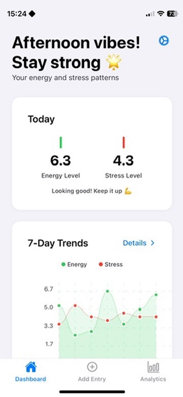
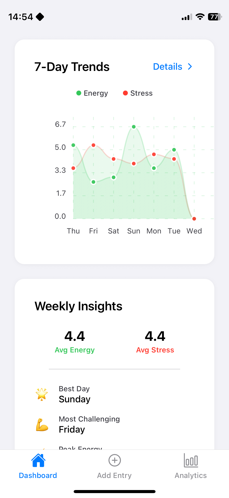
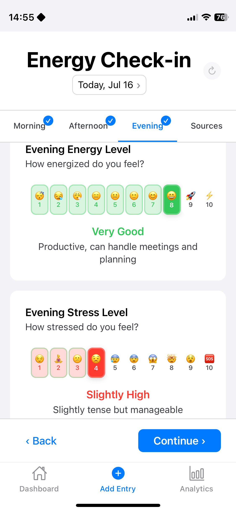
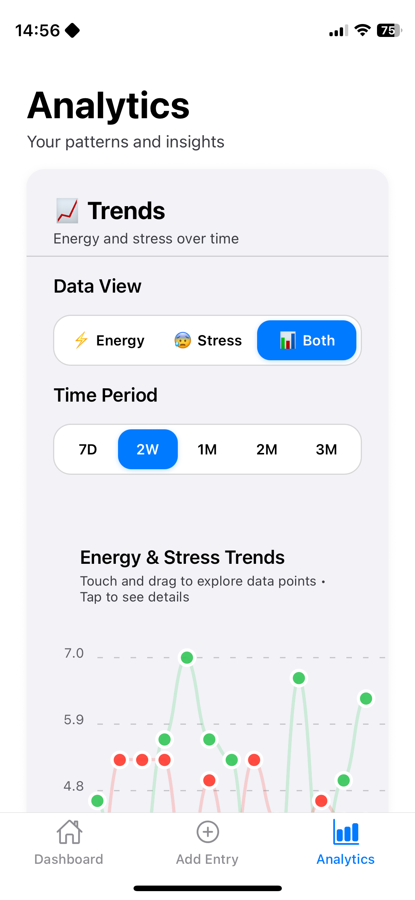
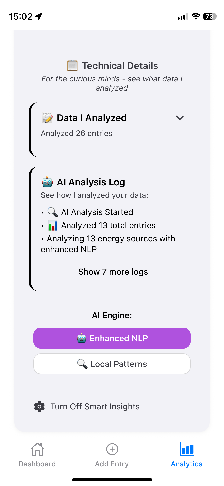

# EnergyTune

**Professional Energy & Stress Tracking App**

A React Native + Expo app that helps you understand your energy patterns. Born from my own need to track stress and energy data during coaching, it's been validated through over a year of personal use. Designed for quick daily logging (3 taps) with complete local privacy.

> **Why EnergyTune?** Unlike basic mood trackers, EnergyTune reveals long-term energy patterns across work and personal life, helping busy professionals identify peak productivity windows and eliminate stress triggers before they become chronic burnout cycles.


## 📱 App Preview

<div align="center">
  
### 🌟 Featured: Energy Dashboard


<sub><em>Track your energy patterns with minimalist-style elegance</em></sub>

---

### 📸 Complete Experience

<table align="center">
  <tr>
    <td align="center" width="200">
      
      <br><sub><b>Weekly Trends</b><br>7-day energy patterns</sub>
    </td>
    <td align="center" width="200">
      
      <br><sub><b>3-Tap Entry</b><br>Log in seconds, seamless flow</sub>
    </td>
    <td align="center" width="200">
      
      <br><sub><b>Trends</b><br>Your data, explained</sub>
    </td>
  </tr>
  <tr>
    <td align="center">
      
      <br><sub><b>Profile</b><br>Import & export, it's your data</sub>
    </td>
    <td align="center">
      
      <br><sub><b>Smart Insights</b><br>Personal insights by local AI</sub>
    </td>
    <td align="center">
      
      <br><sub><b>Understand analytics</b><br>Unraveling the blackbox</sub>
    </td>
  </tr>
</table>

</div>

<div align="center">
  <sub>✨ <em>Clean, intuitive design that feels native on every platform</em></sub>
</div>

## ✨ Key Features

- **🚀 Zero Learning Curve**: Intuitive native-style interface
- **⚡ Sub-200ms Response**: Optimized performance with haptic feedback
- **📱 Cross-Platform**: iOS, Android, and Web support
- **🔄 Offline-First**: Local storage with AsyncStorage
- **📊 Smart Analytics**: Pattern recognition and actionable insights
- **🎨 Native Design**: Human Interface Guidelines compliance
- **🔒 Privacy-First**: 100% local AI - your data never leaves your device

## 🌱 Why I Built This

During a coaching session, I was asked about my stress factors - and realized I had no real data, just vague feelings. So I started tracking them. But focusing only on stress felt draining, so I added energy gains for balance. What started as a simple web app for my own use has been running for over a year now, and the patterns it revealed are super helpful to me.

EnergyTune helps when you notice patterns like crashing every Tuesday afternoon or feeling drained after certain types of meetings, but also when you want to understand what actually energizes you.

**Especially useful if you:**

- Track other health metrics but miss the energy/stress connection
- Want to understand your patterns without sending data to yet another company
- Need something that works offline (no internet dependency)
- Appreciate being able to verify privacy claims through open code
- Prefer tools that respect your time (3 taps, done)

## 🚀 Quick Start

### Prerequisites

- Node.js 18+
- npm or yarn
- Expo CLI (or use npx)

### Installation

```bash
# Clone and install
git clone https://github.com/quarocx/energytune.git
cd energytune
npm install

# Start development server
npx expo start
```

### Platform Options

- **Web**: Press `w` or visit http://localhost:8081
- **iOS**: Press `i` (requires Xcode)
- **Android**: Press `a` (requires Android Studio)
- **Device**: Scan QR code with Expo Go app

## ✅ Implementation Status

### Completed ✅

- [x] **Core Infrastructure**: Expo JavaScript setup with clean architecture
- [x] **Design System**: Native-style colors, typography, spacing (8px grid)
- [x] **Data Models**: Well-structured data interfaces for DailyEntry, analytics, insights
- [x] **Navigation**: Tab-based navigation (Dashboard/Entry/Analytics)
- [x] **UI Components**: Button, Card, Input with haptic feedback
- [x] **Rating System**: Energy/Stress rating with button-based selection
- [x] **Charts**: React Native Chart Kit trend visualization
- [x] **Analytics**: Local AI pattern recognition & insights generation
- [x] **Local Storage**: AsyncStorage for offline-first data persistence
- [x] **Web Platform**: React Native Web support
- [x] **Smart Insights**: Local and lightweight AI pattern recognition

### Next Steps 🔄

- [ ] **Advanced AI pattern recognition**: Offline data-privacy friendly pattern analysis

## 🛠️ Tech Stack

| Category       | Technology             | Purpose                           |
| -------------- | ---------------------- | --------------------------------- |
| **Framework**  | React Native + Expo    | Cross-platform development        |
| **Language**   | JavaScript (ES6+)      | Modern JavaScript development     |
| **Charts**     | React Native Chart Kit | Data visualization                |
| **Navigation** | React Navigation       | Screen routing                    |
| **Storage**    | AsyncStorage           | Local data persistence            |
| **AI/ML**      | Custom lightweight AI  | Privacy-first pattern recognition |
| **Styling**    | StyleSheet             | Native-style design system        |

## 🔧 Development

### Available Scripts

```bash
# Development
npx expo start              # Start with platform choice
npx expo start --web        # Web-only development
npx expo start --clear      # Clear Metro cache
```

## 🔒 Privacy & Transparency

**Why Open Source Code?** We believe privacy claims require proof, not just promises.

- **🔍 Audit the Code**: Every line is visible - verify our privacy claims yourself
- **🚫 No Hidden Data Collection**: No analytics, tracking, or telemetry
- **💾 100% Local Storage**: Your data never leaves your device
- **🛡️ No External APIs**: All AI processing happens locally
- **📱 Offline-First**: Works completely without internet connection

_"Trust, but verify" - Ronald Reagan_

## 📄 License

This project is licensed under the **Audit-Only License** - see the [LICENSE](LICENSE) file for details.

**The source code is available for:**

- ✅ Security and privacy auditing
- ✅ Educational purposes
- ✅ Transparency verification

**Not permitted:**

- ❌ Commercial use or redistribution
- ❌ Creating competing applications
- ❌ Compilation or deployment

---

<div align="center">
  <sub>Built with ❤️ in Europe</sub>
</div>
