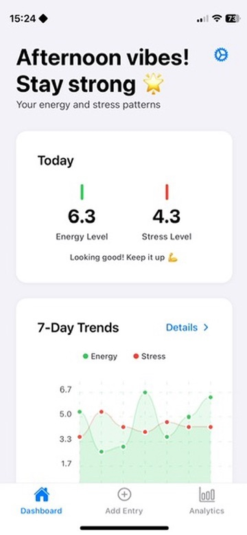
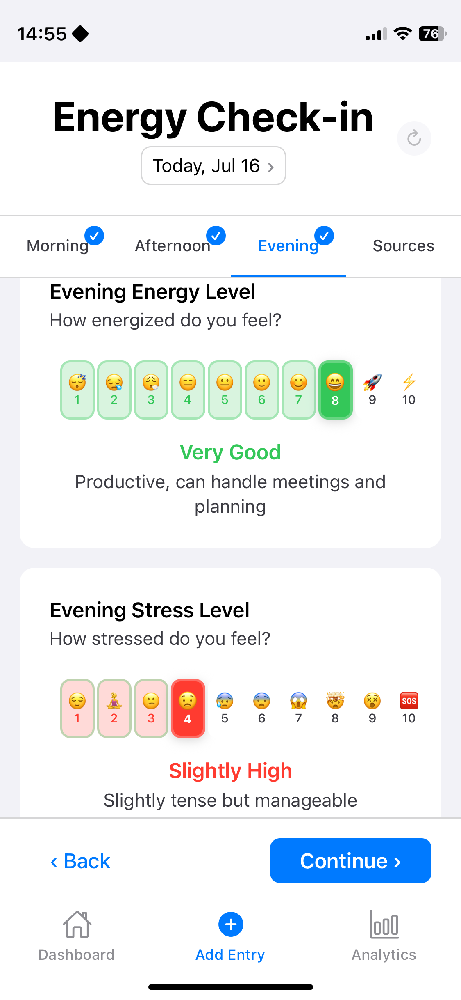
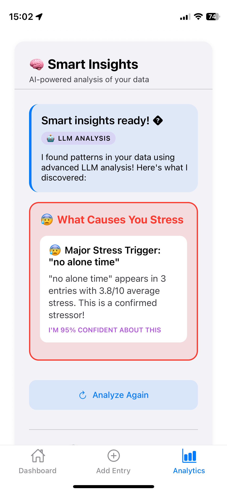
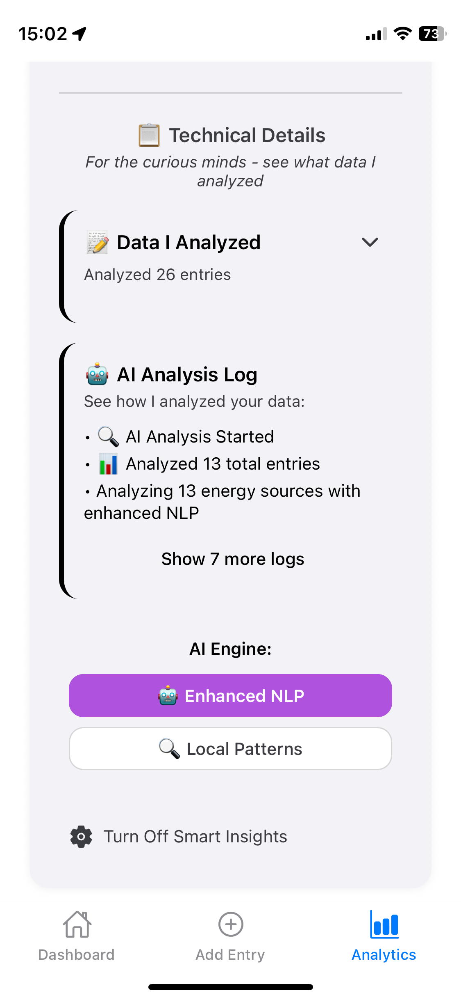

# EnergyTune

**Professional Energy & Stress Tracking App**

A React Native + Expo app for tracking energy and stress patterns with native-style design excellence. Built for zero learning curve, max 3 taps for daily entry, and sub-200ms response times.

> **Why EnergyTune?** Unlike basic mood trackers, EnergyTune reveals long-term energy patterns across work and personal life, helping busy professionals identify peak productivity windows and eliminate stress triggers before they become chronic burnout cycles.


## 📱 App Preview

<div align="center">
  
### 🌟 Featured: Energy Dashboard


<sub><em>Track your energy patterns with minimalist-style elegance</em></sub>

---

### 📸 Complete Experience

<table align="center">
  <tr>
    <td align="center" width="200">
      
      <br><sub><b>Weekly Trends</b><br>7-day energy patterns</sub>
    </td>
    <td align="center" width="200">
      
      <br><sub><b>3-Tap Entry</b><br>Log in seconds, seamless flow</sub>
    </td>
    <td align="center" width="200">
      
      <br><sub><b>Trends</b><br>Your data, explained</sub>
    </td>
  </tr>
  <tr>
    <td align="center">
      
      <br><sub><b>Profile</b><br>Import & export, it's your data</sub>
    </td>
    <td align="center">
      
      <br><sub><b>Smart Insights</b><br>Personal insights by local AI</sub>
    </td>
    <td align="center">
      
      <br><sub><b>Understand analytics</b><br>Unraveling the blackbox</sub>
    </td>
  </tr>
</table>

</div>

<div align="center">
  <sub>✨ <em>Clean, intuitive design that feels native on every platform</em></sub>
</div>

## ✨ Key Features

- **🚀 Zero Learning Curve**: Intuitive native-style interface
- **⚡ Sub-200ms Response**: Optimized performance with haptic feedback
- **📱 Cross-Platform**: iOS, Android, and Web support
- **🔄 Offline-First**: Local storage with AsyncStorage
- **📊 Smart Analytics**: Pattern recognition and actionable insights
- **🎨 Native Design**: Human Interface Guidelines compliance
- **🔒 Privacy-First**: 100% local AI - your data never leaves your device

## 🎯 Perfect For

**Remote professionals, busy parents, and knowledge workers** who experience:

- Energy crashes during critical work hours
- Stress from constant context switching
- Need to optimize both productivity and personal time
- Want to prevent burnout before it affects career and relationships

## 🚀 Quick Start

### Prerequisites

- Node.js 18+
- npm or yarn
- Expo CLI (or use npx)

### Installation

```bash
# Clone and install
git clone https://github.com/quarocx/energytune.git
cd energytune
npm install

# Start development server
npx expo start
```

### Platform Options

- **Web**: Press `w` or visit http://localhost:8081
- **iOS**: Press `i` (requires Xcode)
- **Android**: Press `a` (requires Android Studio)
- **Device**: Scan QR code with Expo Go app

## ✅ Implementation Status

### Completed ✅

- [x] **Core Infrastructure**: Expo JavaScript setup with clean architecture
- [x] **Design System**: Native-style colors, typography, spacing (8px grid)
- [x] **Data Models**: Well-structured data interfaces for DailyEntry, analytics, insights
- [x] **Navigation**: Tab-based navigation (Dashboard/Entry/Analytics)
- [x] **UI Components**: Button, Card, Input with haptic feedback
- [x] **Rating System**: Energy/Stress rating with button-based selection
- [x] **Charts**: React Native Chart Kit trend visualization
- [x] **Analytics**: Local AI pattern recognition & insights generation
- [x] **Local Storage**: AsyncStorage for offline-first data persistence
- [x] **Web Platform**: React Native Web support
- [x] **Smart Insights**: Local and lightweight AI pattern recognition

### Next Steps 🔄

- [ ] **Advanced AI pattern recognition**: Offline data-privacy friendly pattern analysis

## 🛠️ Tech Stack

| Category       | Technology             | Purpose                           |
| -------------- | ---------------------- | --------------------------------- |
| **Framework**  | React Native + Expo    | Cross-platform development        |
| **Language**   | JavaScript (ES6+)      | Modern JavaScript development     |
| **Charts**     | React Native Chart Kit | Data visualization                |
| **Navigation** | React Navigation       | Screen routing                    |
| **Storage**    | AsyncStorage           | Local data persistence            |
| **AI/ML**      | Custom lightweight AI  | Privacy-first pattern recognition |
| **Styling**    | StyleSheet             | Native-style design system        |

## 🔧 Development

### Available Scripts

```bash
# Development
npx expo start              # Start with platform choice
npx expo start --web        # Web-only development
npx expo start --clear      # Clear Metro cache
```

## 🔒 Privacy & Transparency

**Why Open Source Code?** We believe privacy claims require proof, not just promises.

- **🔍 Audit the Code**: Every line is visible - verify our privacy claims yourself
- **🚫 No Hidden Data Collection**: No analytics, tracking, or telemetry
- **💾 100% Local Storage**: Your data never leaves your device
- **🛡️ No External APIs**: All AI processing happens locally
- **📱 Offline-First**: Works completely without internet connection

_"Trust, but verify" - Ronald Reagan_

## 📄 License

This project is licensed under the **Audit-Only License** - see the [LICENSE](LICENSE) file for details.

**The source code is available for:**

- ✅ Security and privacy auditing
- ✅ Educational purposes
- ✅ Transparency verification

**Not permitted:**

- ❌ Commercial use or redistribution
- ❌ Creating competing applications
- ❌ Compilation or deployment

---

<div align="center">
  <sub>Built with ❤️ in Europe</sub>
</div>
