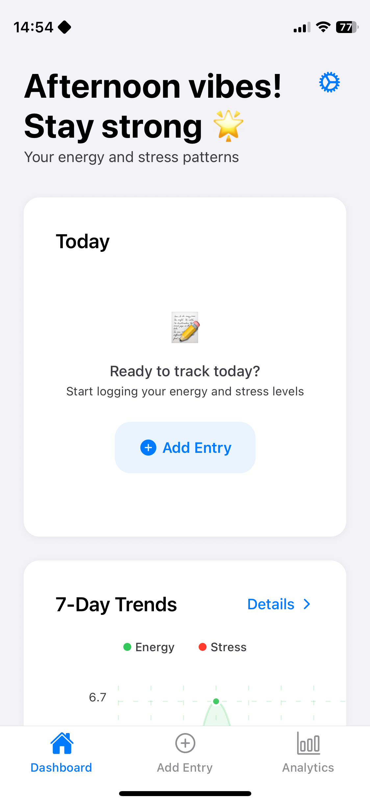
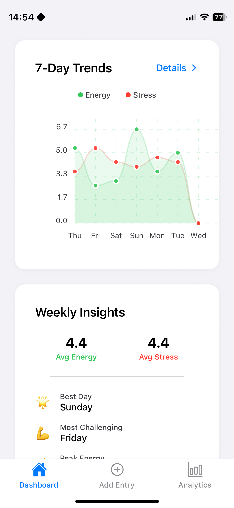
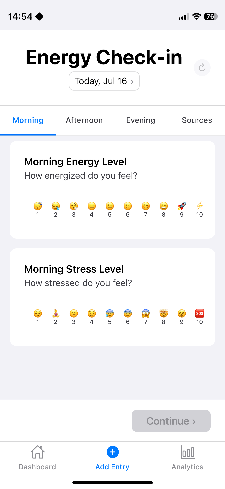
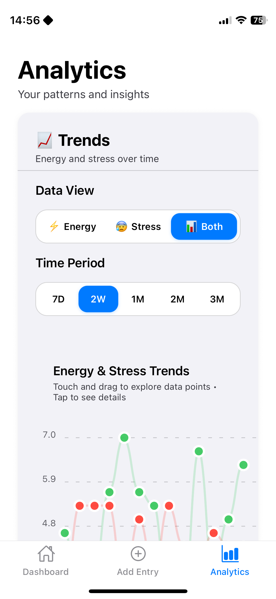

# EnergyTune

**Professional Energy & Stress Tracking App**

A React Native + Expo app for tracking energy and stress patterns with Apple-style design excellence. Built for zero learning curve, max 3 taps for daily entry, and sub-200ms response times.


## ✨ Key Features

- **🚀 Zero Learning Curve**: Intuitive Apple-style interface
- **⚡ Sub-200ms Response**: Optimized performance with haptic feedback
- **📱 Cross-Platform**: iOS, Android, and Web support
- **🔄 Offline-First**: Local storage with AsyncStorage
- **📊 Smart Analytics**: Pattern recognition and actionable insights
- **🎨 Apple Design**: Human Interface Guidelines compliance

## 📱 App Preview

<div align="center">
  
### 🌟 Featured: Energy Dashboard


<sub><em>Track your energy patterns with Apple-style elegance</em></sub>

---

### 📸 Complete Experience

<table align="center">
  <tr>
    <td align="center" width="200">
      
      <br><sub><b>Weekly Trends</b><br>7-day energy patterns</sub>
    </td>
    <td align="center" width="200">
      
      <br><sub><b>3-Tap Entry</b><br>Log in seconds</sub>
    </td>
    <td align="center" width="200">
      
      <br><sub><b>Smart Insights</b><br>AI-powered patterns</sub>
    </td>
  </tr>
  <tr>
    <td align="center">
      
      <br><sub><b>Personalization</b><br>Tailored experience</sub>
    </td>
    <td align="center">
      
      <br><sub><b>Your Profile</b><br>Personal insights</sub>
    </td>
    <td align="center">
      
      <br><sub><b>Data Trends</b><br>Long-term patterns</sub>
    </td>
  </tr>
</table>

</div>

<div align="center">
  <sub>✨ <em>Clean, intuitive design that feels native on every platform</em></sub>
</div>

## 🚀 Quick Start

### Prerequisites

- Node.js 18+
- npm or yarn
- Expo CLI (or use npx)

### Installation

```bash
# Clone and install
git clone https://github.com/quarocx/energytune.git
cd energytune
npm install

# Start development server
npx expo start
```

### Platform Options

- **Web**: Press `w` or visit http://localhost:8081
- **iOS**: Press `i` (requires Xcode)
- **Android**: Press `a` (requires Android Studio)
- **Device**: Scan QR code with Expo Go app

## ✅ Implementation Status

### Completed ✅

- [x] **Core Infrastructure**: Expo JavaScript setup with clean architecture
- [x] **Design System**: Apple-style colors, typography, spacing (8px grid)
- [x] **Data Models**: Well-structured data interfaces for DailyEntry, analytics, insights
- [x] **Navigation**: Tab-based navigation (Dashboard/Entry/Analytics)
- [x] **UI Components**: Button, Card, Input with haptic feedback
- [x] **Rating System**: Energy/Stress rating with button-based selection
- [x] **Charts**: React Native Chart Kit trend visualization
- [x] **Analytics**: Local AI pattern recognition & insights generation
- [x] **Local Storage**: AsyncStorage for offline-first data persistence
- [x] **Web Platform**: React Native Web support
- [x] **Smart Insights**: Local and lightweight AI pattern recognition

### Next Steps 🔄

- [ ] **Advanced AI pattern recognition**: Offline data-privacy friendly pattern analysis

## 🛠️ Tech Stack

| Category       | Technology             | Purpose                           |
| -------------- | ---------------------- | --------------------------------- |
| **Framework**  | React Native + Expo    | Cross-platform development        |
| **Language**   | JavaScript (ES6+)      | Modern JavaScript development     |
| **Charts**     | React Native Chart Kit | Data visualization                |
| **Navigation** | React Navigation       | Screen routing                    |
| **Storage**    | AsyncStorage           | Local data persistence            |
| **AI/ML**      | Custom lightweight AI  | Privacy-first pattern recognition |
| **Styling**    | StyleSheet             | Apple-style design system         |

## 🔧 Development

### Available Scripts

```bash
# Development
npx expo start              # Start with platform choice
npx expo start --web        # Web-only development
npx expo start --clear      # Clear Metro cache
```

Built with ❤️ in Europe
